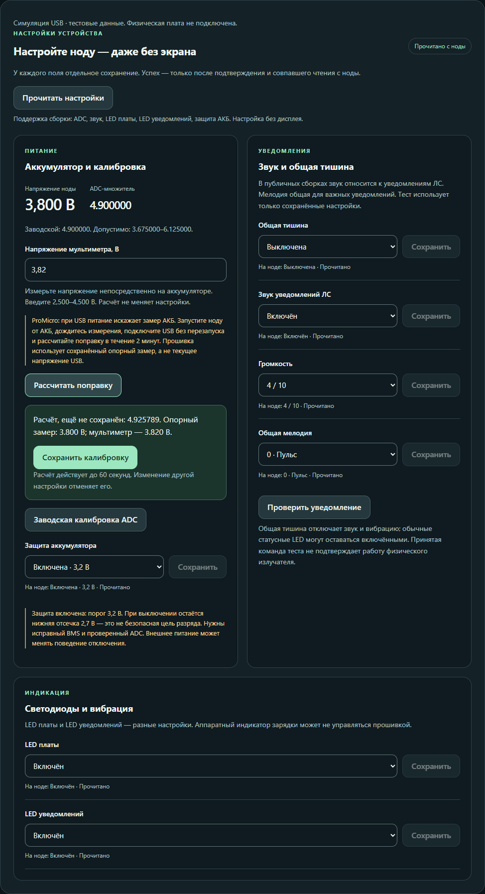
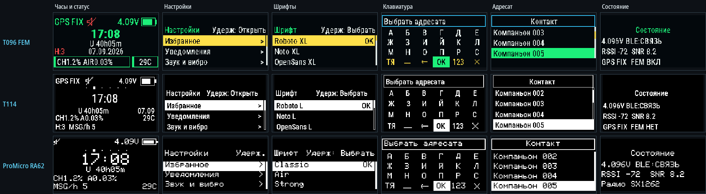
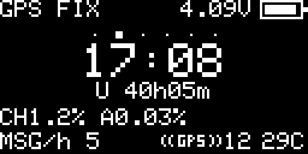
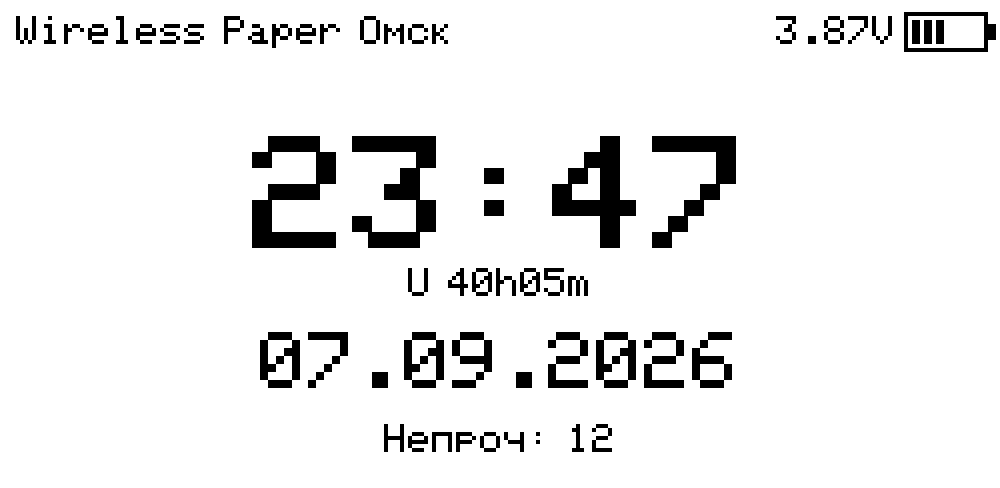

# MeshCore Smart UI — PowerSaving17

> [!NOTE]
> **Текущий публичный выпуск — Smart UI 0.10.**
> [Скачать Smart UI 0.10](https://github.com/YaziAranea/MeshCore/releases/tag/smartui-0.10) · [Изменения и выбор файла](RELEASE_NOTES_SmartUI_0.10_RU.md) · [Нумерация старых выпусков](docs/RELEASE_NUMBERING_RU.md).
> Встроенная версия и имена новых файлов — `0.10`. Исторические теги и встроенные номера прежних выпусков сохранены. USB Helper имеет отдельную нумерацию.

> [!IMPORTANT]
> **Новое в 0.10 — API v1 для сторонних приложений и Python Developer Kit.** Чтение возможностей и настроек, управление поддерживаемыми функциями, калибровка батареи и настройка Wi-Fi через BLE/USB. Это расширение companion-протокола, не замена радиообмена MeshCore. [Инструкция RU](docs/SMARTUI_API_RU.md) · [Specification EN](docs/SMARTUI_API_EN.md) · [Developer Kit](https://github.com/YaziAranea/MeshCore/releases/download/smartui-0.10/SmartUI_Developer_Kit_0.10.zip).
> **Wi-Fi/TCP допускает запись без нового пароля или TLS.** Только доверенная локальная сеть, без проброса порта в Интернет. Событий и подписок API пока нет; физическая проверка всех транспортов и плат не заявляется.
> AGC из 0.09 сохранён: по умолчанию `ВЫКЛ`, интервал не менее 60 секунд с отсрочкой по активности. Это пробная профилактика с коротким окном без приёма, не доказанное исправление связи.
> Настройки через USB из 0.08 сохранены: калибровка батареи, звук, LED, GPS и защита АКБ доступны в USB-помощнике 1.3 в пределах возможностей платы. Отдельного переключателя AGC в помощнике нет. [Пошаговая инструкция](tools/usb-helper/README_RU.md).
> Полная отложенная запись всё ещё может задержать главный цикл. Устранение всех пауз радио/BLE и аппаратная стабильность всех плат не заявляются. Подробнее — [границы проверки](RELEASE_NOTES_SmartUI_0.10_RU.md#что-проверяется-а-что-ещё-требует-устройства).
> Возможности чата и компактное меню предыдущего публичного 0.06 сохранены. [Как пользоваться](docs/TEST_0.06_USER_GUIDE_RU.md).

## USB-помощник 1.3

[Скачать HTML](https://github.com/YaziAranea/MeshCore/releases/download/smartui-0.10/SmartUI_USB_Helper_1.3.html) · [ZIP с инструкцией и снимками интерфейса](https://github.com/YaziAranea/MeshCore/releases/download/smartui-0.10/SmartUI_USB_Helper_1.3.zip) · [Пошаговая инструкция](tools/usb-helper/README_RU.md).

**На ноде выберите Bluetooth, к компьютеру подключите USB-кабель. Телефон и сопряжение Bluetooth не нужны.** `USB-компаньон` — другой режим: в нём помощник недоступен.

1. Откройте HTML в Chrome или Edge на компьютере. Закройте флешер и другие программы, занявшие COM-порт; используйте кабель с передачей данных.
2. Нажмите `Выбрать USB-порт`, выберите ноду и дождитесь `Консоль SmartUI подключена`. Heltec V3 и Wireless Paper сначала разбудите кнопкой.
3. Настройки прочитаются автоматически. Для повторного чтения нажмите `Прочитать настройки`; изменённое поле применяйте его кнопкой `Сохранить`.

Настройки читаются с ноды, а не угадываются по названию платы. Настройки устройства доступны с прошивки 0.08 и сохранены в 0.10. Вход без экрана из режима USB-компаньона описан в [инструкции](tools/usb-helper/README_RU.md#настройки-устройства-без-дисплея). Ниже — программный снимок помощника с имитацией USB, не результат измерения физической платы.



> [!WARNING]
> **Базовый выпуск — Smart UI 0.04 по новой нумерации** (встроенная версия `0.06`): обновление PowerSaving и исправления по аудиту.
> [Скачать прошивку](https://github.com/YaziAranea/MeshCore/releases/tag/smartui-0.06)
> · [Что изменилось и какой файл выбрать](RELEASE_NOTES_SmartUI_0.06_RU.md).
> Базовый выпуск сохранён отдельно. Метка GitHub Latest сама по себе не подтверждает аппаратную стабильность.
> [Smart UI 0.03](https://github.com/YaziAranea/MeshCore/releases/tag/smartui-0.05) (встроенная версия `0.05`) сохранён для отката.

Неофициальная русскоязычная прошивка MeshCore Companion с компактным экранным интерфейсом для шести плат:

- Heltec T096 с включённым FEM/LNA;
- Heltec T114 с цветным TFT;
- ProMicro nRF52840 + Heltec RA62 + OLED 128×64;
- Heltec WiFi LoRa 32 V3 с OLED 128×64;
- Heltec V4.3 OLED с включённым FEM/LNA;
- Heltec Wireless Paper с e-paper 250×122.

В 0.06 исправлены восстановление настроек подключения, гонка BLE-очередей nRF52, устаревший GPS FIX и потеря ввода при idle/уведомлениях. Готовые ответы проходят выбор адресата; в «Сервис» появилась страница «О прошивке», USB-помощник обновлён до 1.1. Постоянных черновиков нет. [Исправления и границы проверки](docs/AUDIT_FIXES_0.06_RU.md). Старые иллюстрации ниже показывают сохранённые элементы UI; это симуляции, не аппаратная проверка 0.06.

[⬇ Скачать Smart UI 0.10](https://github.com/YaziAranea/MeshCore/releases/tag/smartui-0.10) · [Как выбрать файл](RELEASE_NOTES_SmartUI_0.10_RU.md) · [Инструкция по прошивке](docs/FLASHING_RU.md)

**Выбор подключения, добавленный в 0.05, сохранён.** На V3/V4.3/Paper доступны Bluetooth, USB Serial и Wi-Fi; на T096/T114/ProMicro — Bluetooth и USB Serial. Сеть настраивается через USB-консоль или USB-помощник 1.3. Первое Wi-Fi/TCP-приложение принимается автоматически, порт **5000**. Отдельного TCP-пароля/TLS нет: только доверенная локальная сеть, без проброса порта в Интернет. Одновременно работает один канал приложения, USB-консоль остаётся доступна в BLE/Wi-Fi. [Инструкция](docs/CONNECTIONS_0.06_RU.md). [Внешний GPS ProMicro](docs/PROMICRO_GPS_RU.md), уведомления и LED сохранены. Заставка — `MeshCore` / `0.10`; архив — `SmartUI_0.10_all-boards.zip`.

> [!WARNING]
> **Все ESP32 merged в 0.06 содержат пустое подготовленное хранилище.**
> Предыдущая FS1 не устранила ошибку на пользовательской V3.
> Чистый установочный **merged** записывается по `0x0` и **удаляет identity/настройки даже без Erase Flash**.
> Работающую ноду обновляйте только `update.bin` по `0x10000` **без очистки**.
> Новые короткие имена приведены в примечаниях: проверяйте SHA256 и V3 FS2 в общем манифесте.
> FS2 автоматически готовит хранилище штатной библиотекой только при точном совпадении
> с известным пустым заводским образом. В остальных случаях стирание требует двух
> подтверждений кнопкой; отказ и бездействие ничего не стирают.



| Heltec V4.3 OLED | Heltec Wireless Paper |
|---|---|
|  |  |

[Открыть проект на GitHub](https://github.com/YaziAranea/MeshCore)

> Это независимая модификация, не официальный выпуск MeshCore или IoTThinks. В 0.06 база `PowerSaving-v17` обновлена до [`a27e78e4`](https://github.com/IoTThinks/MeshCore/commit/a27e78e4da1389055b6dd16ce473112d25c8a5cd). Сборки и симуляции не означают физическое испытание всех плат. Чёрный экран V4.3 после app-only update не объявляется исправленным.

История PS17-порта сохранена в ветках [`smartui-ps17.1`](https://github.com/YaziAranea/MeshCore/tree/smartui-ps17.1) и [`smartui-2.1-beta.2`](https://github.com/YaziAranea/MeshCore/tree/smartui-2.1-beta.2). Для ближайшего отката сохранён [SmartUI 0.08](https://github.com/YaziAranea/MeshCore/releases/tag/smartui-0.08).

Текущая публичная ветка — [`smartui-0.10`](https://github.com/YaziAranea/MeshCore/tree/smartui-0.10).
[Разница с предыдущим публичным 0.09](https://github.com/YaziAranea/MeshCore/compare/smartui-0.09...smartui-0.10).

## Что умеет интерфейс

- Часы, сеть, чат, непрочитанные ЛС, анонс, настройки и выключение без пустых страниц.
- Компактный аптайм находится на экране часов и не занимает отдельный пункт меню.
- Русский компактный UI, понятные статусы и аккуратное сокращение длинных строк через `...`.
- Экранная клавиатура в быстрых ответах.
- Адресная отправка набранного сообщения в известный чат или companion-контакту; ретрансляторы из списка контактов исключены.
- Непрочитанные ЛС выбираются по одному: чтение, адресный ответ, отметка прочитанным и отсрочка напоминания. Возможности прежней test.1 сохранены.
- Одна общая мелодия важных уведомлений; на T096/T114/ProMicro серия ограничена двумя проигрываниями, повтор непрочитанного — через две минуты от начала предыдущей серии.
- Ночной запрос тишины в 23:30 с отключением звука до 07:30.
- Выбор шрифта и темы отдельными списками.
- Аппаратный GPS на T096/T114/V4.3; на ProMicro — внешний UART/NMEA GPS, по умолчанию выключен. На GPS-странице ProMicro отсутствие данных UART отличается от поиска спутников. Wireless Paper и V3 остаются без GPS.
- Исправлен выход ProMicro из сна: первое нажатие будит OLED без обязательного Reset.
- Калибровка измерения АКБ доступна на всех поддерживаемых платах.
- Исправлены потерянные при PS17-переносе настройки зуммера, чтение ключей `prefs.json`, содержащих цифры, и полная синхронизация времени назад вместе с timestamp сообщений.
- Wireless Paper выпускается одной сборкой `FULL`: экранная клавиатура и адресная отправка сохранены, лесной фон убран.
- BLE PIN доступен отдельной ручной страницей на всех шести платах, не перехватывает часы/сообщения/сон и сохраняется между обычными перезагрузками.
- GPIO уведомлений и резонанс зуммера выбираются без записи каждого промежуточного значения: сохранение только по подтверждению.
- `LED платы` — общий выключатель встроенных индикаторов MCU: статус, LoRa TX и уведомление на том же встроенном GPIO. Отдельный внешний LED на другом GPIO остаётся независимым.
- Защита АКБ по умолчанию использует 3,2 В; при её выключении остаётся нижний порог 2,7 В. Сохранённый выбор пользователя сохраняется.
- OLED-профили не включают неиспользуемые крупные таблицы шрифтов; внешний вид пяти компактных OLED-шрифтов сохранён.
- Настройки, контакты, каналы и identity сохраняются через проверенные временную и резервную копии; повреждённая identity не заменяется молча новым адресом.
- Часы различают доверенную синхронизацию и приблизительное время из mesh; ночной режим не запускается по недостоверному времени, часовой пояс выбирается от UTC−12:00 до UTC+14:00.

## Поддерживаемые платы

| Плата | Дисплей | GPS в этой цели | Формат development-сборки |
|---|---:|---:|---|
| Heltec T096 FEM ON | TFT 160×80 | Аппаратный | UF2 |
| Heltec T114 с дисплеем | ST7789 240×135 | Аппаратный | UF2 |
| ProMicro nRF52840 + Heltec RA62 | SSD1306 OLED 128×64 | Внешний UART, опционально | UF2 |
| Heltec WiFi LoRa 32 V3 | SSD1306 OLED 128×64 | Нет | merged + update BIN |
| Heltec V4.3 OLED FEM ON | SSD1306 OLED 128×64 | Аппаратный | merged + update BIN |
| Heltec Wireless Paper | e-paper 250×122 | Нет | merged + update BIN |

Это не прошивка для FakeTec/HT-RA62, V4 TFT, T114 без дисплея или произвольной ProMicro-распайки. Подробности: [поддерживаемое оборудование](docs/SUPPORTED_BOARDS_RU.md).

## Быстрый старт

Используйте [Release Smart UI 0.10](https://github.com/YaziAranea/MeshCore/releases/tag/smartui-0.10). Для отката сохранён [предыдущий публичный 0.09](https://github.com/YaziAranea/MeshCore/releases/tag/smartui-0.09). Проверка сборок и симуляции не означает испытание каждого экземпляра платы.

1. Откройте [GitHub Releases](https://github.com/YaziAranea/MeshCore/releases) или артефакты нужного CI-run и скачайте файл строго для своей платы.
2. Скачайте контрольные суммы из того же выпуска: `SHA256SUMS.txt` для трёх UF2 и `SHA256SUMS-ESP32.txt` для всех шести BIN. В общем ZIP находятся те же файлы и `RELEASE-MANIFEST.json`.
3. Подключите плату исправным USB-кабелем с передачей данных.
4. Для nRF52 переведите плату в UF2-загрузчик быстрым двойным нажатием **Reset**. Для ESP32-S3 используйте Web Flasher или `esptool`.
5. На nRF52 скопируйте UF2 своей платы на USB-диск, без Erase. На работающей V3/V4.3/Wireless Paper используйте `update.bin` по адресу `0x10000` без Erase, с совместимыми загрузчиком и таблицей разделов. Для чистой установки используйте **merged** по `0x0`: он сбрасывает данные даже без Erase. Подробности — в [инструкции](docs/FLASHING_RU.md).
6. Подключитесь из совместимого MeshCore-клиента. Если клиент просит PIN/passkey, с экрана часов сделайте один переход вперёд и введите показанные шесть цифр.

Полная инструкция: [прошивка](docs/FLASHING_RU.md) и [проверка SHA-256](docs/VERIFY_RU.md).

## Управление одной кнопкой

| Действие | Результат |
|---|---|
| Один щелчок | Следующий экран или пункт |
| Двойной щелчок | Предыдущий экран или пункт |
| Долгое нажатие | Выбрать / открыть / подтвердить |
| Долгое нажатие на часах | Включить или выключить тишину |
| Тройной щелчок | Вернуться на главный экран |

Если дисплей погас, первое нажатие может только разбудить его. В первые 8 секунд после старта долгое нажатие выполняет служебное действие, а не выбирает пункт: в режиме USB-компаньона возвращает Bluetooth и доступ к помощнику, в остальных режимах включает CLI Rescue. Полная карта: [управление](docs/CONTROLS_RU.md).

## Сборка из исходников

Установите [PlatformIO](https://platformio.org/install), откройте корень репозитория и выполните нужную команду:

```text
pio run -e Heltec_t096_companion_radio_ble_femon -t create_uf2
pio run -e Heltec_t114_companion_radio_ble -t create_uf2
pio run -e ProMicro_ra62_companion_radio_ble -t create_uf2
pio run -e Heltec_v3_companion_radio_ble_smartui -t mergebin
pio run -e heltec_v4_3_companion_radio_ble_femon_smartui -t mergebin
pio run -e Heltec_Wireless_Paper_companion_radio_ble_smartui_full -t mergebin
```

Для nRF52 получится `firmware.uf2`. Для ESP32-S3 нужны оба файла: `firmware-merged.bin` и `firmware.bin`. Подробная воспроизводимая процедура: [сборка](docs/BUILD_RU.md).

## Важные предупреждения

- Свежие настройки используют радиопрофиль `869.618 MHz / BW 62.5 kHz / SF8 / CR5`. Это не означает, что профиль разрешён в вашей стране.
- T096 работает с внешним FEM; не передавайте без подходящей антенны и не повышайте мощность без измерений.
- Импорт и экспорт приватного ключа включены на уровне companion-протокола. Никому не отправляйте экспортированный ключ и не добавляйте его в Git.
- Phone GPS намеренно не поддерживается: телефон не отдаёт координаты ноде без отдельного приложения или сервиса.
- Обычная прошивка может сохранить старые настройки ноды. Перед обновлением сохраните идентичность безопасным способом и проверьте радиопараметры после запуска.
- **Все ESP32 merged содержат подготовленное пустое SPIFFS**: оно перезаписывает identity/настройки даже без Erase. Для сохранения данных используйте update. У каждой платы своя разметка: V3-файлы не подходят V4.3 или Wireless Paper.
- Резервный `prefs.json` содержит чувствительные настройки и BLE PIN в открытом виде. Не публикуйте его. Возврат на stock может удалить секцию `smart_ui` при пересохранении настроек.
- BLE PIN не блокирует физический экран: человек с доступом к устройству может читать локальные чаты и открыть PIN-страницу. Порог 2,7 В — резервная отсечка, не рекомендация разряжать аккумулятор до этого значения; нужен исправный аппаратный BMS и проверенный ADC.
- На Wireless Paper GPIO45/VEXT питает одновременно дисплей и LoRa-тракт. Не включайте display auto-off и не переносите туда настройки обычного OLED.
- V4.3 и Wireless Paper не имеют заявленного физического зуммера; tone GPIO для них намеренно не выдуман.
- `LED платы: ВЫКЛ` действует только на встроенные светодиоды, которыми управляет MCU. Он не отключает физический индикатор зарядки, напрямую подключённый к схеме питания.
- На ProMicro отключён автономный BLE connection LED до запуска Bluefruit; BLE продолжает работать. Поправка V5 (`LED2`) сохранена в 0.06 и блокирует обход выключателя через flash/cache на T114/T096/ProMicro; запись данных не отключается.

Подробнее: [безопасность и радио](docs/SECURITY_RADIO_RU.md).

## Проверки и статус разработки

Изменения и границы проверки `SmartUI 0.10` описаны в [примечаниях к выпуску](RELEASE_NOTES_SmartUI_0.10_RU.md). Контрольные суммы и манифест публикуются рядом с файлами Release после успешной сборки CI. Проверки старых версий сохранены в их исторических примечаниях и не выдаются за результаты нового выпуска.

Основной CI собирает все шесть релизных конфигураций из одного commit: девять прошивок, общий ZIP, USB-помощник и Developer Kit — всего 17 файлов. V3 FS2 и подготовленная SPIFFS проверяются в этом же pipeline. Старый `Heltec_v3_companion_radio_ble` остаётся compile-only представителем общего драйвера, а не V3-файлом SmartUI. Xiao S3 WIO и Heltec T1 не добавляются в Release.

Heltec T1 остаётся нерелизной контрольной платой. Её USB-вариант в CI проверяет общий UI/display-код; обе companion-конфигурации T1 используют `-Os` и помещаются в штатную flash-разметку с ExtraFS. Это не добавляет T1 в список поддерживаемых файлов Release. RAK4631 также не является релизной или обязательной compatibility-целью. Все шесть публикуемых конфигураций собираются отдельно; [подробности](docs/BUILD_RU.md#целевые-сборки).

T096 симулируется с реальными bitmap-метриками, T114 — через масштабирование 128×64 → 240×135, OLED — по встроенным glyph-таблицам, Wireless Paper — в физической геометрии 250×122. Симуляция не заменяет проверку на устройстве, включая реальный порог отключения аккумулятора.

## Документация

- [Полное описание проекта](README_RU.md)
- [Поддерживаемые платы](docs/SUPPORTED_BOARDS_RU.md)
- [Управление](docs/CONTROLS_RU.md)
- [Экраны, меню, шрифты и симуляции](docs/SCREENS_RU.md)
- [Прошивка готового UF2 или BIN](docs/FLASHING_RU.md)
- [Сборка из исходников](docs/BUILD_RU.md)
- [Проверка SHA-256](docs/VERIFY_RU.md)
- [Безопасность и радиопараметры](docs/SECURITY_RADIO_RU.md)
- [История изменений](CHANGELOG.md)
- [Примечания к Smart UI 0.10](RELEASE_NOTES_SmartUI_0.10_RU.md)
- [Примечания к прежней встроенной версии 0.06](RELEASE_NOTES_SmartUI_0.06_RU.md)
- [Подключение внешнего GPS к ProMicro](docs/PROMICRO_GPS_RU.md)
- [Предыдущий SmartUI V5](RELEASE_NOTES_SmartUI_V5_RU.md)
- [Прежний выпуск SmartUI V4](RELEASE_NOTES_SmartUI_V4_RU.md)
- [Прежний выпуск SmartUI V3](RELEASE_NOTES_SmartUI_V3_RU.md)
- [Исторические примечания к experimental.2](RELEASE_NOTES_v2.1.0-experimental.2_RU.md)
- [Историческое дополнение Heltec V3 OLED](V3_ADDENDUM_v2.1.0-experimental.1_RU.md)
- [Примечания к v2.1.0-beta.2](RELEASE_NOTES_v2.1.0-beta.2_RU.md)
- [Примечания к v2.1.0-dev.2](RELEASE_NOTES_v2.1.0-dev.2_RU.md)
- [Примечания к v2.1.0-dev.1](RELEASE_NOTES_v2.1.0-dev.1_RU.md)
- [Примечания к v2.1.0-dev](RELEASE_NOTES_v2.1.0-dev_RU.md)
- [Примечания к v2.0.0-rc1](RELEASE_NOTES_v2.0.0-rc1_RU.md)

## Лицензии и авторство

MeshCore и эта производная работа распространяются по лицензии MIT; исходное уведомление Scott Powell / rippleradios.com сохранено в [LICENSE](LICENSE). Встроенные растровые варианты шрифтов созданы из Roboto Condensed под Apache License 2.0 и четырёх гарнитур под SIL Open Font License 1.1. Полный список и ссылки на тексты лицензий находятся в [THIRD_PARTY_NOTICES.md](THIRD_PARTY_NOTICES.md).
