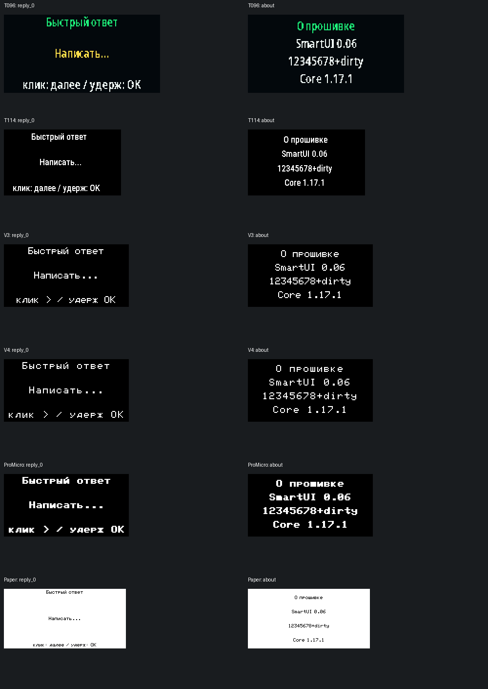

# Аудит → исправления SmartUI 0.06

Основа: официальный Companion 1.17.1 (`d9296435`); PowerSaving-v17 обновлён с `a3b9ad91` до `a27e78e4`. Слияние сохраняет историю upstream и наши изменения. Дополнительные коммиты official main после 1.17.1 на момент проверки затрагивают документацию, не прошивку.

## Проверяемые регрессии

1. **GPS:** старый RMC повторно ставил RTC после перерыва. Production-провайдеры и менеджер проверяются с настоящим MicroNMEA, подменено только железо. Тест `tools/test_onboard_gps.py`; отдельно `tools/test_optional_uart_gps.py`.
2. **Настройки подключения:** сбой восстановления или очистки мог терять режим либо возвращать забытые Wi-Fi-реквизиты. Двухзагрузочные и crash-cut сценарии в `tools/test_connection_controller.py`. Отказ записи не маскируется успешным сохранением.
3. **Bluetooth nRF52:** гонка сдвига массива RX/TX. Кольцевые очереди, короткий task critical, поколение сессии. `tools/test_nrf_ble_queue.py` вызывает production-методы при обоих значениях connection selector. Не моделирует радиоканал или весь SoftDevice.
4. **Редактор:** автопереход и popup уничтожали ввод. `tools/test_ui_sessions_v006.py` исполняет извлечённые методы C++; проверяет idle, wake, e-ink, popup, sleep guard и готовые ответы. Постоянных черновиков нет.
5. **Разметка:** `tools/test_ui_render_v006.py` исполняет production-renderer с реальными таблицами шрифтов T096/T114/OLED/Paper. Учитываются физические коэффициенты T114 и неравномерные метрики T096. Не заменяет фото физического дисплея.
6. **Энергосбережение:** `tools/test_smartui_sleep_policy.py` проверяет политику блокировки и rollover; UI-тест отдельно покрывает Paper. Физический ток и автономность не измерялись.
7. **Метаданные:** `info`, страница «О прошивке» и манифест разделяют UI/core/source/upstream. Упаковщик проверяет встроенный source marker, не только имя файла.

## Симуляция изменённых экранов

Изображения — симуляция. `12345678+dirty` здесь намеренно демонстрационный длинный идентификатор для проверки ширины; в опубликованной сборке показывается её реальный короткий SHA без `+dirty`.

## Не выдаём за исправленное

1. Отзыв о бутлупе V4.3 при app-only update: нужен boot log; формат и разметка остаются прежними.
2. Внутренний lifetime-риск pinned BLE framework при disconnect во время blocking notify. Нужна отдельная доработка/обновление библиотеки с аппаратными испытаниями.
3. Точное энергопотребление UI относительно исходного PowerSaving: по коду нельзя доказать миллиамперы или время работы от конкретного аккумулятора.
4. Автоматический TCP остаётся доверенным LAN-интерфейсом без собственного пароля/TLS — это согласованное поведение, не безопасный интернет-сервис.
