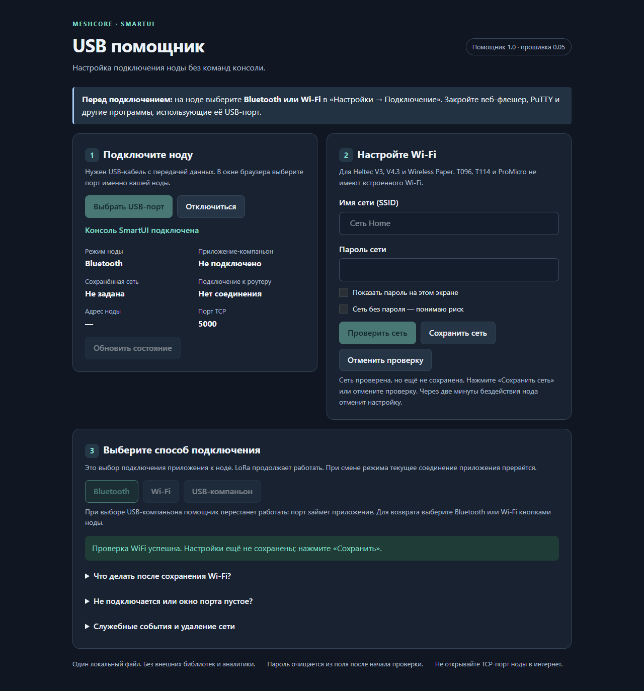

# Подключение к ноде — SmartUI 0.05

Одна прошивка, один выбранный способ подключения приложения. Менять прошивку для перехода между Bluetooth, USB и Wi-Fi не нужно.

## Самый простой способ: USB-помощник

В [релизе 0.05](https://github.com/YaziAranea/MeshCore/releases/tag/smartui-0.05) скачайте `SmartUI_USB_Helper_1.0.zip`, распакуйте и откройте HTML в Chrome или Edge на компьютере. Установка не нужна. На ноде выберите Bluetooth или Wi-Fi, закройте веб-флешер и другие программы, использующие USB-порт, затем нажмите «Выбрать USB-порт».

Помощник показывает статус и позволяет проверить Wi-Fi, отдельно сохранить сеть и выбрать способ подключения. На T096/T114/ProMicro Wi-Fi недоступен. Помощник не прошивает и не очищает память. Он работает с уже загруженной прошивкой; для диагностики бутлупа нужен обычный загрузочный лог, не этот помощник.

[Пошаговая инструкция и ограничения](../tools/usb-helper/README_RU.md). Ручная консоль описана ниже — оба способа используют те же команды.



Изображение получено в браузере с тестовым USB-устройством; это демонстрация интерфейса, не физическое испытание платы.

## Какие платы поддерживаются

| Плата | Bluetooth | USB-компаньон | Wi-Fi/TCP |
| --- | --- | --- | --- |
| T096, T114, ProMicro RA62 | Да | Да | Нет: у этих плат нет Wi-Fi |
| Heltec V3, Heltec V4.3, Wireless Paper | Да | Да | Да |

При первом запуске после обновления с 0.04 выбран Bluetooth. Дальше выбранный режим сохраняется. Радиосвязь LoRa не зависит от этого выбора.

USB здесь — разъём USB самой платы, видимый на компьютере как COM-порт. Это **не UART для GPS** на ProMicro: GPS и USB-компаньон используют разные подключения.

## Выбор на экране

Откройте **Настройки → Подключение**. Здесь показаны текущий режим и состояние соединения. Откройте выбор режима, выберите нужный и подтвердите смену. Недоступные плате способы не предлагаются.

Смена режима отключает прежнего клиента. Контакты, сообщения и настройки радио не стираются. Одновременно управлять нодой из нескольких приложений через разные способы подключения нельзя.

Вернуться к Bluetooth можно в этом же меню кнопками ноды — рабочий Wi-Fi или USB для этого не нужен.

## Настройка Wi-Fi через USB

Нужна обычная сеть Wi-Fi 2,4 ГГц. Это подключение ноды к роутеру, **не собственная точка доступа ноды**. Страницы браузера с настройками в этой версии нет.

### Если никогда не пользовались консолью

Консоль — окно на компьютере: вы отправляете короткую команду, нода отвечает текстом. Это не программирование и не перепрошивка. Обычная домашняя сеть требует **имя сети (SSID) и пароль**, не логин отдельной учётной записи. Сети с веб-авторизацией или корпоративной авторизацией этим мастером не настраиваются.

Для Windows можно использовать [PuTTY с официального сайта](https://www.chiark.greenend.org.uk/~sgtatham/putty/latest.html):

1. Закройте веб-флешер и другие программы, работающие с нодой. На ноде выберите Bluetooth или Wi-Fi, не USB-компаньон.
2. Подключите USB. В Windows откройте «Диспетчер устройств → Порты (COM и LPT)». Запомните порт ноды, например `COM7`. Если сомневаетесь, посмотрите, какой порт исчезает при отключении кабеля.
3. Запустите PuTTY. В разделе **Session** выберите **Serial**, в **Serial line** укажите свой порт, в **Speed** — `115200`.
4. В **Connection → Serial**: **Data bits = 8**, **Stop bits = 1**, **Parity = None**, **Flow control = None**.
5. В **Terminal**: **Local echo = Force off**, **Local line editing = Force off**. В **Session → Logging** оставьте **None**. В **Window → Translation** используйте **UTF-8**, если имя сети содержит кириллицу.
6. Нажмите **Open**. Даже если окно пустое, наберите `help` и нажмите Enter. Символы ввода не отображаются — это нормально; так же скрывается пароль. Команда должна вызвать ответ ноды.

Названия настроек терминала описаны в [официальном руководстве PuTTY](https://the.earth.li/~sgtatham/putty/latest/htmldoc/Chapter4.html#config-serial).

Не вставляйте весь сценарий сразу. Отправляйте каждую строку после соответствующего запроса. Кавычки вокруг имени сети и пароля не нужны: иначе они станут частью реквизитов.

### Порядок настройки сети

1. На ESP32-плате выберите в меню режим Wi-Fi. Пока сеть не настроена, подключение приложения по Wi-Fi недоступно.
2. Подключите ноду USB-кабелем с передачей данных.
3. Откройте её COM-порт в последовательном терминале: **115200, 8N1**, окончание строки Enter. Выключите **Local echo** и запись сеанса в файл: терминал может самостоятельно показывать или сохранять пароль, даже если прошивка его не выводит.
4. Введите `wifi setup` и нажмите Enter.
5. По запросу введите имя сети, затем пароль. Ввод скрыт; регистр имеет значение.
6. Нода проверит подключение. После `WiFi test passed` введите `wifi save`. До этой команды новые данные не сохраняются.
7. Введите `status`. Скопируйте адрес из `IP=...`.
8. На устройстве в той же локальной сети откройте совместимый клиент MeshCore с поддержкой **TCP/Wi-Fi**, укажите этот IP и порт **5000**.
9. Нода автоматически примет первое подключение приложения. Нажимать кнопку не нужно, экран не просыпается ради запроса. Второй клиент не вытесняет уже подключённый.

Настраивать Wi-Fi можно и в режиме Bluetooth. После успешного `wifi save` выберите Wi-Fi в меню либо выполните `mode wifi`.

Если две минуты ничего не вводить, мастер настройки отменяется: несохранённые данные удаляются, прежняя сеть восстанавливается либо Wi-Fi выключается. Это предотвращает лишний расход батареи, если терминал закрыли посреди настройки.

Не каждое приложение MeshCore поддерживает TCP. Наличие Wi-Fi в прошивке не добавляет этот способ подключения в приложение автоматически. Адрес берите с экрана ноды, порт — **TCP 5000**. На странице подключения показано `TCP: 5000 авто`.

## Команды USB-консоли

```text
help          — список команд
status        — режим, состояние, IP
mode ble      — Bluetooth
mode wifi     — Wi-Fi на ESP32
mode usb      — USB-компаньон; консоль закрывается
wifi setup    — ввод и проверка новой сети
wifi status   — состояние подключения
wifi save     — сохранить успешно проверенную сеть
wifi cancel   — отменить настройку
wifi forget   — удалить сохранённую сеть и вернуться к Bluetooth
```

Консоль работает в режимах Bluetooth и Wi-Fi. В режиме USB-компаньона этот же порт занят двоичным протоколом приложения: команды терминала там не работают. Для возврата используйте меню ноды.

## USB-компаньон

1. Выберите USB в меню ноды.
2. Закройте последовательный терминал: один COM-порт не должен одновременно открываться терминалом и приложением.
3. В совместимом приложении выберите последовательное подключение и COM-порт ноды, скорость 115200.

На платах с USB–UART-преобразователем прошивка не всегда может определить, закрыто ли приложение на компьютере. Там состояние соединения оценивается по активности протокола и может обновиться с задержкой. Сам USB-кабель не считается подключением приложения.

## Безопасность и питание

- Wi-Fi-клиент автоматически получает полный доступ через companion-протокол, включая изменение настроек. Отдельного TCP-пароля и TLS нет. Любой имеющий сетевой доступ к ноде может подключиться: используйте только доверенную локальную сеть, без проброса порта в Интернет. Во время настройки новой сети, сервисного режима и восстановления хранилища новые клиенты не принимаются.
- TCP-соединение не защищено TLS. Используйте доверенную защищённую локальную сеть. Не пробрасывайте порт 5000 в интернет и не используйте этот режим в открытой общественной сети.
- Пароль Wi-Fi не выводится командой `status` и не попадает в исходники или релиз. Он сохраняется в памяти устройства; защиты от физического считывания flash эта функция не обещает.
- Wi-Fi увеличивает потребление. При переходе обратно в Bluetooth или USB Wi-Fi выключается. Для автономной работы предпочтителен Bluetooth.
- При потере сети нода повторяет попытки подключения с паузами. LoRa продолжает работать; бесконечного блокирующего ожидания роутера нет.
- При важном уведомлении или открытом редакторе запрос нового Wi-Fi-клиента может быть отклонён, чтобы не прервать текущую работу. Повторите подключение после закрытия экрана.

## Если не получилось

**Нет порта:** проверьте кабель и драйвер USB-платы. **Нет текста в терминале:** проверьте, не выбран ли USB-компаньон; верните Bluetooth кнопками. **Wi-Fi test failed:** проверьте имя/пароль, сеть 2,4 ГГц и уровень сигнала; прежние сохранённые данные при неудачном тесте не заменяются.

Для подключения через Wi-Fi не требуется сброс настроек, очистка flash или повторная прошивка. При обновлении используйте обычный update-файл своей платы; fresh-install с очисткой удаляет пользовательские данные.

**Пример результата `status`:**

```text
Mode=WiFi companion=idle via=none USB-service=on WiFi-config=yes link=associated IP=192.168.1.42 approval=none
```

Это означает: выбран Wi-Fi, реквизиты сохранены, нода подключена к роутеру по адресу `192.168.1.42`, но приложение пока не подключено. Этот адрес — пример; используйте адрес своей ноды. Когда приложение подключится и вы разрешите доступ, появится `companion=connected via=WiFi`.

**Завершение:** после `wifi save` и проверки `status` можно закрыть терминал и отключить USB, если нода получает питание от аккумулятора или другого источника. Сохранённая сеть останется после перезагрузки. Для отмены во время ввода имени/пароля наберите `cancel`; после проверки сети используйте `wifi cancel`.

Проверки сборки и симуляции не заменяют испытание физического USB, Wi-Fi и Bluetooth на конкретной плате и в конкретном приложении.
