# Экраны, меню и шрифты

Изображения ниже — пиксельная симуляция интерфейса SmartUI PS17. Первые три платы сохраняют основной контракт `v2.0.0-rc1`; V4.3 и Wireless Paper добавлены в линии 2.1. Hotfix `2.1.0-dev.1` добавляет общую PIN-страницу всем пяти платам. Это не фотографии и не подтверждение электрической проверки.

## Как сделаны изображения

Все картинки ниже — программные симуляции, а не фотографии плат. Пиксели увеличены без сглаживания:

- T096 рисуется с реальными метриками встроенных bitmap-шрифтов;
- T114 проходит аппаратное масштабирование 128×64 → 240×135;
- ProMicro использует точную таблицу кириллицы 5×7 для OLED 128×64.
- V4.3 OLED использует ту же реальную glyph-table, но проверяется отдельной матрицей GPS/тишина/АКБ.
- Wireless Paper рисуется в физическом framebuffer 250×122, 1-bit, с реальными профилями E213 и clipping.

Симуляция проверяет геометрию, метрики шрифтов, обрезку строк и выделение пунктов. Она не проверяет реальные цвета, яркость, угол обзора и электронику. Фотография реальной платы имеет приоритет при любом расхождении.

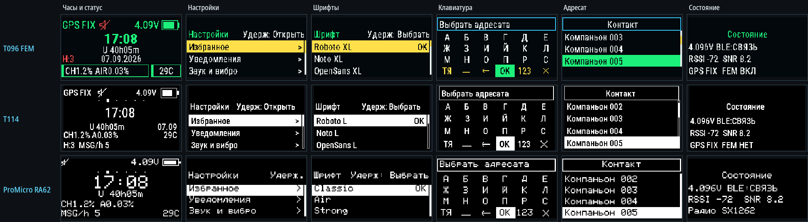

## Основные экраны

Главная карусель содержит только полезные и доступные данной плате страницы: часы, сеть, чат, анонс, настройки и выключение. До BLE-связи hotfix `2.1.0-dev.1` добавляет отдельную ручную страницу активного BLE PIN на всех пяти платах; после подключения она скрывается.

| Плата | Часы и статус | Группы настроек | Состояние |
|---|---|---|---|
| T096 FEM | 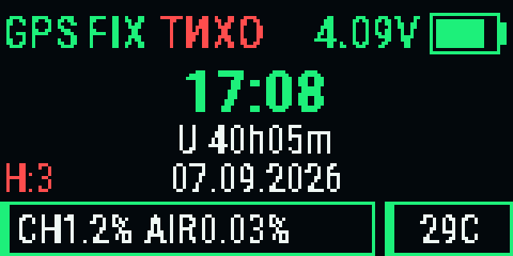 | 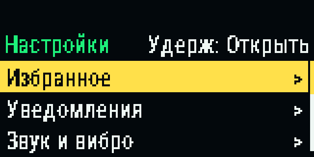 | 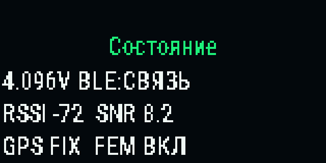 |
| T114 | 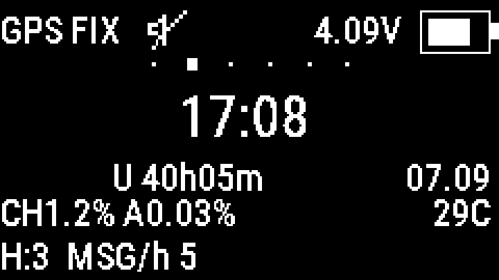 | 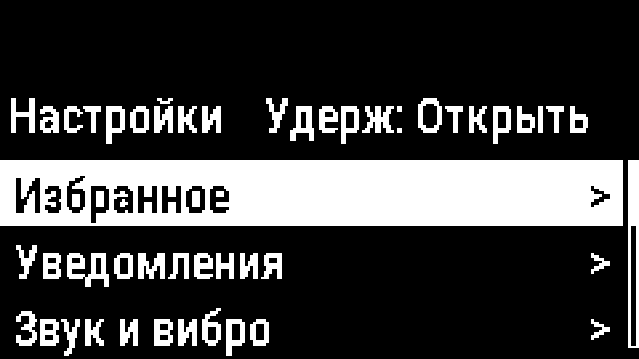 | 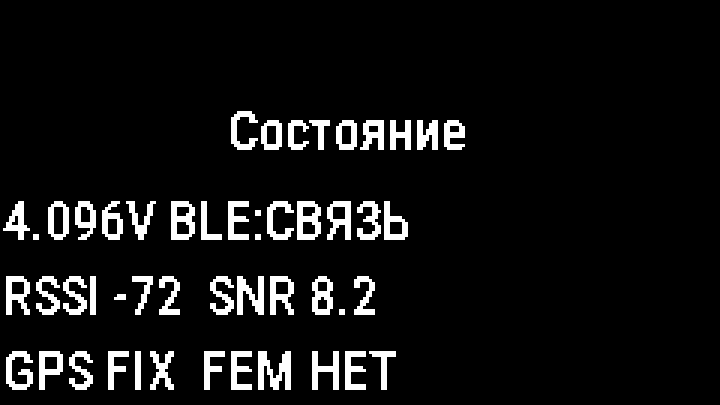 |
| ProMicro RA62 | 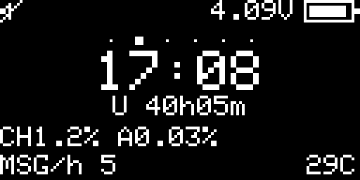 | 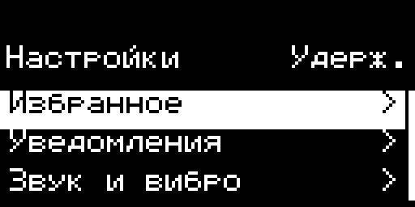 | 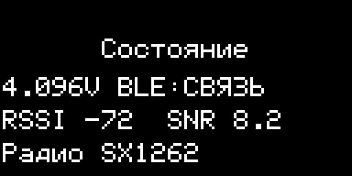 |
| V4.3 OLED | 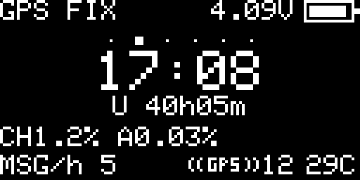 | те же компактные 128×64 группы | аппаратный GPS + FEM |
| Wireless Paper | 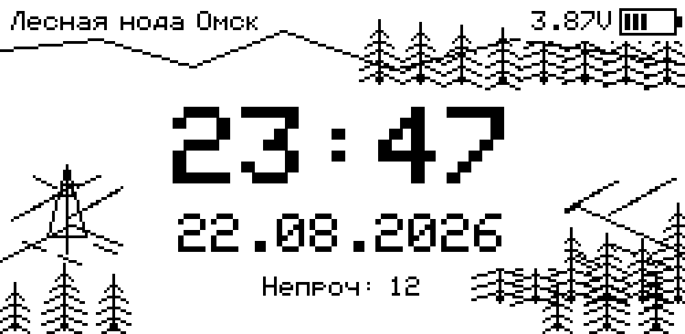 | 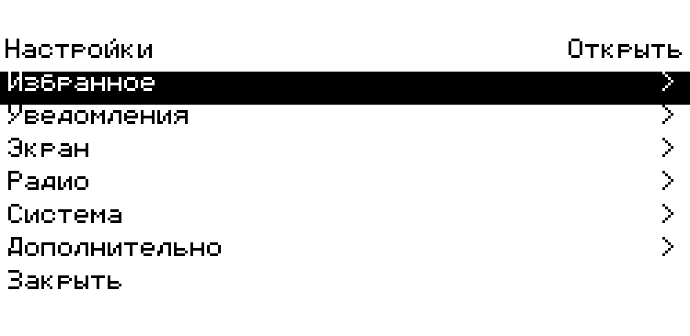 | e-paper 250×122 |

На T096, T114 и V4.3 OLED статус GPS относится к аппаратному модулю. На ProMicro и Wireless Paper GPS нет, поэтому его статус и настройки скрыты. Пустые экраны между чатом и настройками удалены.

## BLE PIN и первое сопряжение

На T096, T114, ProMicro RA62, V4.3 OLED и Wireless Paper используется один сценарий: с часов один переход вперёд открывает активные шесть цифр. Клиент или операционная система может называть их `PIN`, `passkey` или «кодом сопряжения». После связи PIN-страница исчезает из карусели.

Wireless Paper в idle-режиме показывает часы с лесным фоном. PIN не перехватывает запуск, сообщения, телеметрию, пробуждение или screensaver.

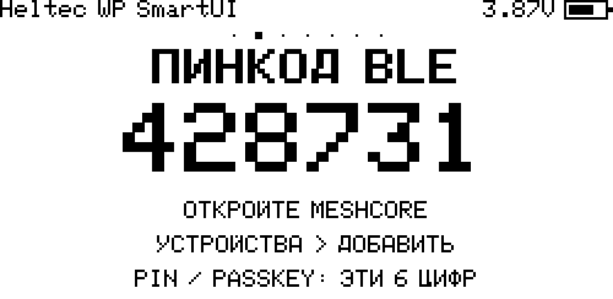

## Клавиатура и выбор адресата

Клавиатура открывается из быстрых ответов. В верхней строке всегда остаётся виден конец длинного UTF-8 текста и каретка. Рамок вокруг каждой буквы нет: заливкой выделяется только текущая клавиша.

| Плата | Клавиатура | Выбор адресата |
|---|---|---|
| T096 FEM | 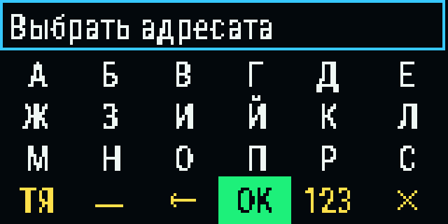 | 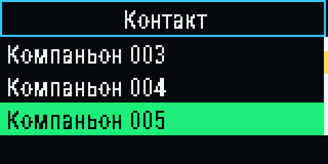 |
| T114 | 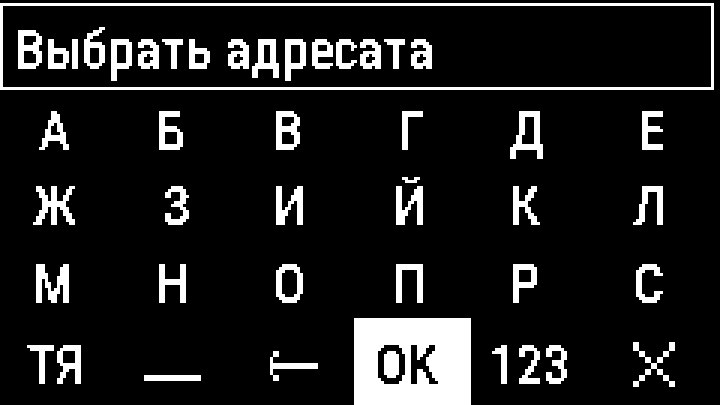 | 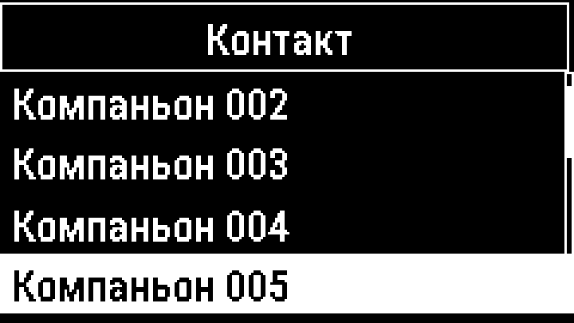 |
| ProMicro RA62 | 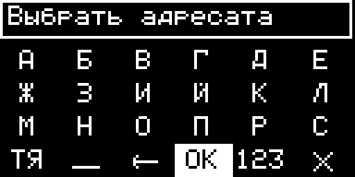 | 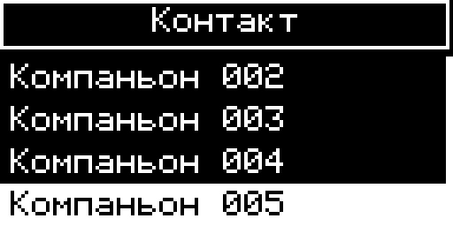 |
| V4.3 OLED | геометрия и glyph-table как у OLED 128×64 | target picker как у OLED 128×64 |
| Wireless Paper FULL | 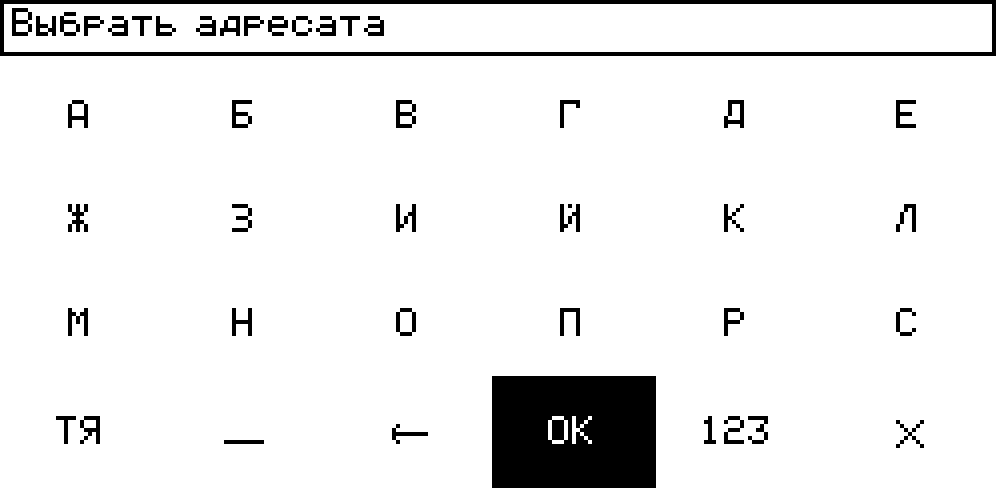 | target picker 250×122 |

Один щелчок перемещает курсор вперёд, двойной — назад, долгое нажатие выбирает символ. `OK` открывает `Чаты` / `Контакты` / `Назад`. В контактах показываются только companion-узлы типа `ADV_TYPE_CHAT`; ретрансляторы исключены.

## Непрочитанные личные сообщения

Окно непрочитанных не копирует историю канала. Оно показывает только личные сообщения: отправителей, их количество и последнюю реплику. Отправители сортируются по свежести.

| T096 FEM | T114 | ProMicro RA62 |
|---|---|---|
| 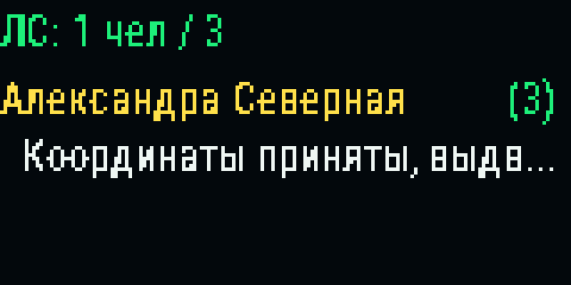 | 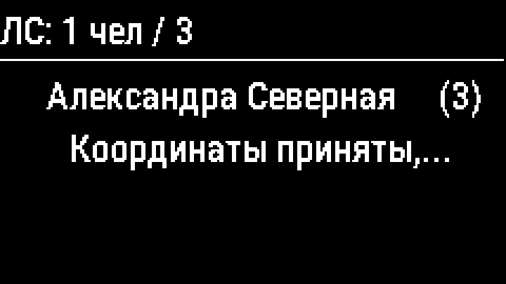 | 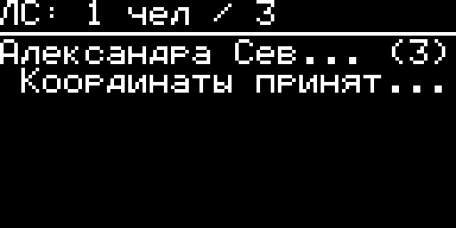 |

## Шрифты

Шрифт выбирается отдельным списком. Активный вариант помечается `OK`, а текущая строка выделяется целиком.

### T096 FEM, TFT 160×80

Доступны 15 публичных профилей: пять семейств в трёх размерах. Самые маленькие служебные профили не выводятся в публичный список.

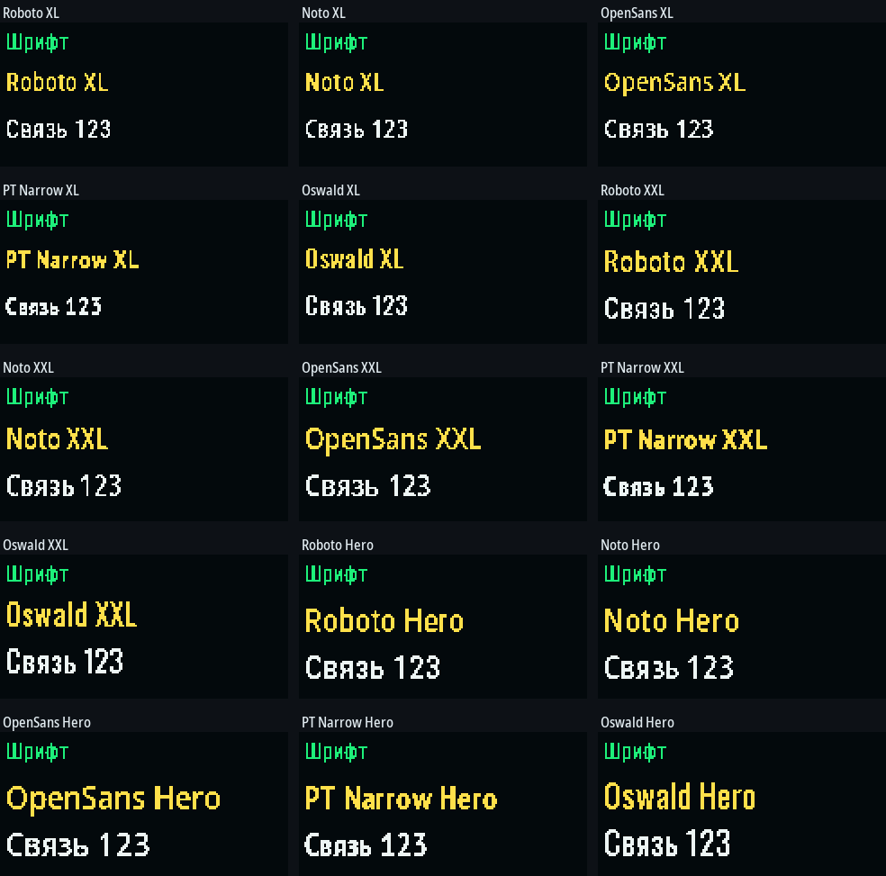

Темы: `Графит`, `Полночь`, `Хвоя`, `Бумага`, `Бордо`, `Север`, `Высокий`.

### T114, TFT 240×135

Доступны 10 профилей: `Roboto L`, `Noto L`, `OpenSans L`, `PT Narrow L`, `Oswald L`, `Roboto XL`, `OpenSans XL`, `Oswald XL`, `Noto XXL`, `PT Narrow XXL`.

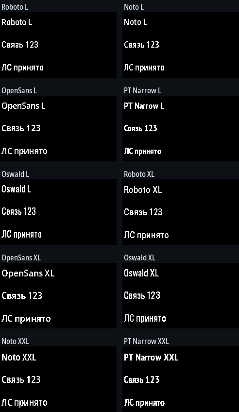

Темы: `Стандарт`, `Циан`, `Янтарь`, `Бумага`, `Красный`, `Рыжий`, `Зеленый`.

### ProMicro RA62, OLED 128×64

Монохромный OLED предлагает пять стилей: `Classic`, `Air`, `Strong`, `Narrow`, `Dense`. Цветных тем на нём нет; выделение выполняется инверсией или заливкой строки.

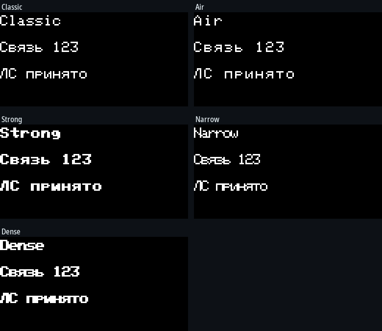

### Heltec V4.3 OLED

Используются те же пять точных OLED-стилей `Classic`, `Air`, `Strong`, `Narrow`, `Dense`. Отдельная симуляция проверяет, что `GPS OFF/ON`, значок тишины и группа напряжения/батареи не перекрываются.

### Heltec Wireless Paper

E213 предлагает пять компактных renderer-profile: `Стандарт`, `Четкий`, `Компакт`, `Моно`, `Плотный`. Это профили над встроенной кириллической bitmap-таблицей, а не тяжёлый набор TrueType-шрифтов. Выделение выполняется чёрно-белой инверсией.

### Как выбрать

- Для максимальной вместимости начните с компактного семейства или размера L.
- Крупный профиль удобен для часов и коротких подписей, но длинные имена обрезаются раньше.
- Клавиатура и системные списки могут временно использовать безопасный компактный role-font, чтобы крупный пользовательский шрифт не ломал сетку.
- `...` означает контролируемую обрезку, а не потерю данных: полное имя остаётся в ноде и клиенте.

## Инженерные QA-матрицы

Полные матрицы отделены от пользовательской галереи. Они показывают граничные случаи и прежние/исправленные варианты:

- [T096: точная QA-матрица](assets/qa/T096_SMARTUI_PS17_EXACT_QA_MATRIX.png);
- [T114: QA после физического масштабирования](assets/qa/T114_SMARTUI_PS17_EXACT_QA_MATRIX.png);
- [T114: аппаратный GPS и границы экрана](assets/qa/T114_SMARTUI_PS17_GPS_APPEARANCE_PHYSICAL_QA.png);
- [ProMicro OLED: точная QA-матрица](assets/qa/OLED_SMARTUI_PS17_EXACT_QA_MATRIX.png).
- [V4.3 OLED: GPS/mute/battery QA](assets/qa/V4_3_OLED_SMARTUI_2_1_EXACT_QA_MATRIX.png).
- [Wireless Paper: 250×122 exact QA](assets/qa/WIRELESS_PAPER_SMARTUI_2_1_EXACT_QA_MATRIX.png).

Интегрированный PS17 RC прошёл `455 PASS / 0 FAIL`. Стресс-тест охватывает 0, 1 и 350 контактов, длинные русские имена, три страницы клавиатуры, 0, 1 и 12 отправителей ЛС, до 30 сохранённых ЛС, все публичные шрифты и состояния GPS T114. Это результат точной модели интерфейса, а не сертификат электрической или радиочастотной части платы.

Полные hotfix-матрицы `2.1.0-dev.1`: core/T096/T114 `470/470`, V4.3 + ProMicro OLED `25/25`, Wireless Paper `180/180`, без выходов за framebuffer и непредусмотренных пересечений. PIN-страница проверена всеми пятью семействами плат и всеми публичными шрифтами; на OLED 128×64 используется подсказка «код в приложении». На e-paper обрезанные концы декоративных линий Wood являются намеренным clipping, а не текстовыми потерями.

## Как пересоздать галерею

Из корня репозитория:

```text
python -m pip install -r requirements-qa.txt
python tools/generate_docs_assets.py
```

Скрипт пересоздаёт пользовательские PNG всех пяти плат в `docs/assets/ui/` и точные V4.3/Wireless Paper матрицы в `docs/assets/qa/`. Внутри он запускает специализированные симуляторы с правильной геометрией и шрифтами. После изменения UI результат нужно проверить визуально.
