# Экраны, меню и шрифты

Изображения ниже — пиксельная симуляция экспериментального интерфейса `v2.1.0-experimental.1`, не фотографии плат. Аптайм находится под часами: `U 40h05m` — 40 часов 5 минут. T114 размещает рядом короткую дату `дд.мм`, компактные OLED используют часы 2×. Экспериментальная версия не заменяет предыдущую beta.2.

## Как сделаны изображения

Все картинки ниже — программные симуляции, а не фотографии плат. Пиксели увеличены без сглаживания:

- T096 рисуется с реальными метриками встроенных bitmap-шрифтов;
- T114 моделирует преобразование драйвера 128×64 → 240×135: X×1,875; Y×2,109375; смещение Y+1. Рисуется настоящая пара foreground/background текущей темы: в драйвере нет независимых RGB-цветов у разных элементов;
- ProMicro использует точную таблицу кириллицы 5×7 для OLED 128×64.
- V4.3 OLED использует ту же реальную glyph-table, но проверяется отдельной матрицей GPS/тишина/АКБ.
- Wireless Paper рисуется в физическом framebuffer 250×122, 1-bit, с реальными профилями E213 и clipping.

Проверки разделены: **bbox** — выделенное элементу место, **ink** — реально зажжённые пиксели, **смысл** — полное обязательное значение и наличие нужной иконки. Не поместившаяся строка или исчезнувший значок не считаются успехом только потому, что остальной экран остался в границах. RGB565 темы моделируются, но реальные яркость, контраст, угол обзора и электроника не проверяются. Фотография платы имеет приоритет при расхождении.


## Основные экраны

Главная карусель содержит только полезные и доступные данной плате страницы: часы, сеть, чат, анонс, настройки и выключение. До BLE-связи отдельная ручная страница показывает активный BLE PIN на всех пяти платах; после подключения она скрывается. Аптайм не занимает отдельную страницу или строку меню: он расположен под цифрами часов.

В experimental.1 переработан общий набор пиктограмм TFT, OLED и Paper. Системный GPS-статус отделён от значка спутника в сообщении; мелкие варианты рисуются в своём размере. Выравнивание учитывает видимые пиксели букв, включая пустые поля bitmap-шрифта. Пиксельные проверки подтверждают воспроизводимость изображения, но человеческую узнаваемость всё равно нужно оценить на плате.

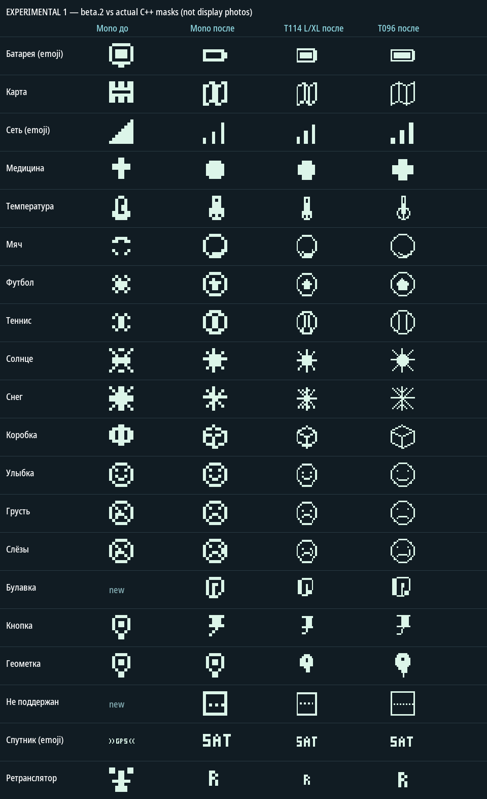

Сравнение выше получено исполнением настоящих C++-функций рисования: слева маски beta.2, справа experimental.1. Это не фотографии, не оценка яркости и не автоматическое доказательство узнаваемости.

| Плата | Часы и статус | Группы настроек | Состояние |
|---|---|---|---|
| T096 FEM |  |  |  |
| T114 |  |  |  |
| ProMicro RA62 |  |  |  |
| V4.3 OLED |  | те же компактные 128×64 группы | аппаратный GPS + FEM |
| Wireless Paper | 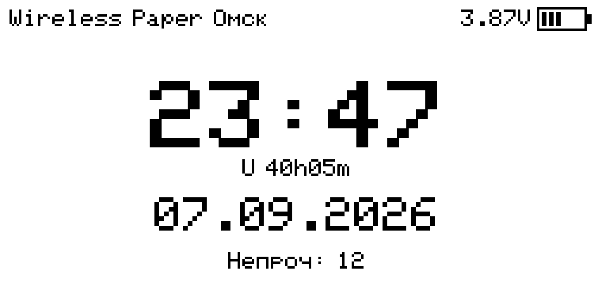 |  | e-paper 250×122 |

На T096, T114 и V4.3 OLED статус GPS относится к аппаратному модулю. На ProMicro и Wireless Paper GPS нет, поэтому его статус и настройки скрыты. Пустые экраны между чатом и настройками удалены.

## BLE PIN и первое сопряжение

На T096, T114, ProMicro RA62, V4.3 OLED и Wireless Paper используется один сценарий: с часов один переход вперёд открывает активные шесть цифр. Клиент или операционная система может называть их `PIN`, `passkey` или «кодом сопряжения». После связи PIN-страница исчезает из карусели.

Wireless Paper в единственной сборке FULL показывает idle-часы без лесного фона. PIN не перехватывает запуск, сообщения, телеметрию, пробуждение или screensaver.


## Клавиатура и выбор адресата

Клавиатура открывается из быстрых ответов. При выборе буквы в верхней строке виден конец длинного UTF-8 текста и каретка. При выборе служебной клавиши эта строка временно объясняет её действие; набранный текст сохраняется. Рамок вокруг каждой буквы нет: заливкой выделяется только текущая клавиша.

| Плата | Клавиатура | Выбор адресата |
|---|---|---|
| T096 FEM |  |  |
| T114 |  |  |
| ProMicro RA62 |  |  |
| V4.3 OLED | геометрия и glyph-table как у OLED 128×64 | target picker как у OLED 128×64 |
| Wireless Paper FULL |  | target picker 250×122 |

Один щелчок перемещает курсор вперёд, двойной — назад, долгое нажатие выбирает символ. `OK` открывает `Чаты` / `Контакты` / `Назад`. В контактах показываются только companion-узлы типа `ADV_TYPE_CHAT`; ретрансляторы исключены. Вход в контакты предлагает недавних адресатов, полный список и поиск по первой букве. Перед передачей появляется отдельное подтверждение: адресат с коротким ID, начало сообщения, `Отправить` и `Назад`.

| Экран | T096 | T114 | OLED ProMicro / V4.3 | Wireless Paper |
|---|---|---|---|---|
| Недавние адресаты | 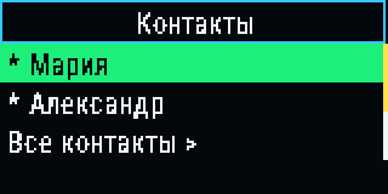 | 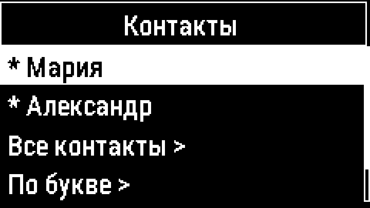 | 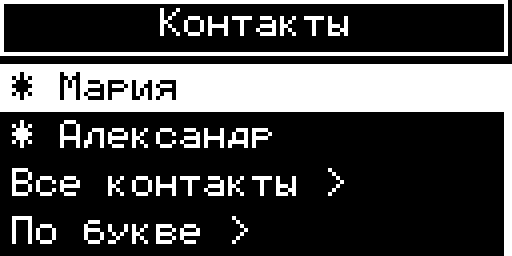 | 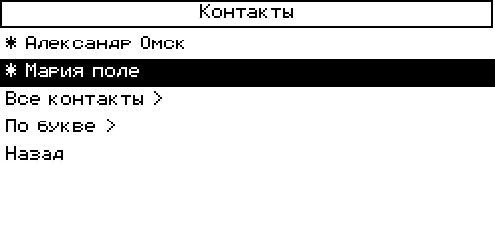 |
| Первая буква | 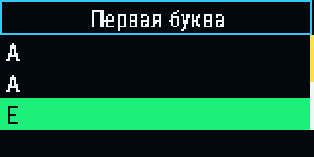 | 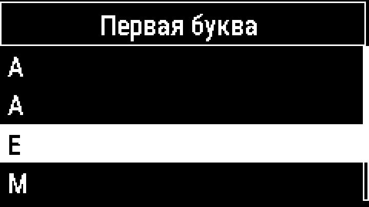 | 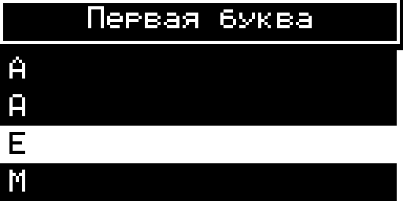 | 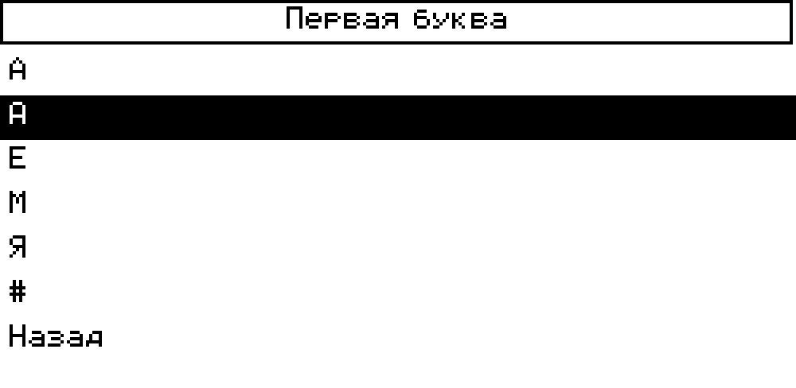 |
| Подтверждение | 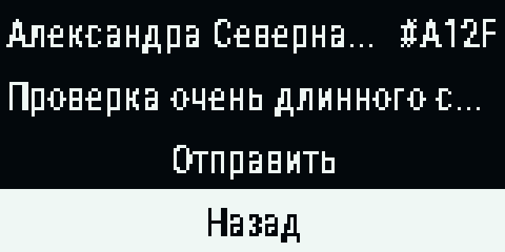 | 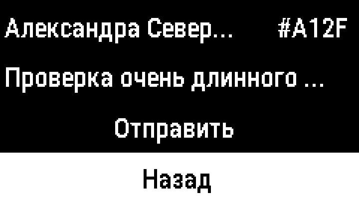 | 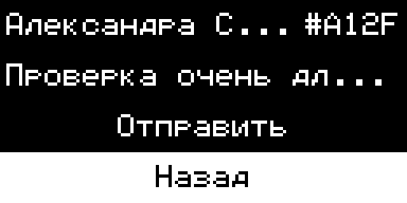 | 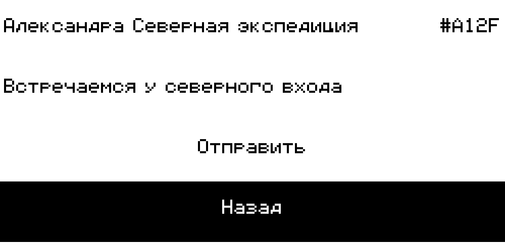 |

Недавние адресаты хранятся только до перезагрузки; первая буква `Ё` группируется вместе с `Е`, нестандартные начала имени — в `#`. Короткий ID помогает различать одинаковые или обрезанные имена, но сам по себе не является проверкой личности.

## Новые настройки и безопасные действия

Корень содержит названия групп без лишней колонки сводок. Контекст в заголовке объясняет действие удержания. Избранное выбирается списком, сброс ADC вынесен в отдельное подтверждение, а инструкция управления доступна прямо в ноде. Ниже показана область меню; общая верхняя строка статуса намеренно не включена в эти листы.

Лист избранного здесь демонстрирует несколько доступных функций, а не полную номенклатуру каждой платы. Реальный список зависит от аппаратных возможностей; V4.3 и Paper не предлагают функции отсутствующего зуммера.

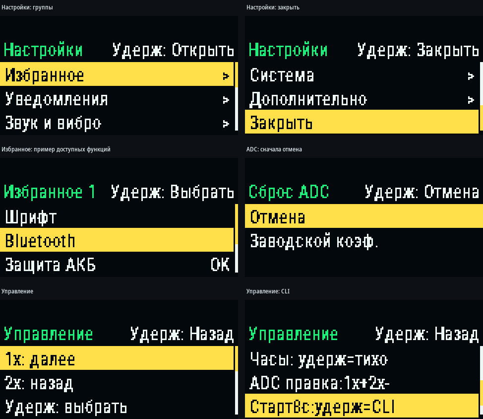

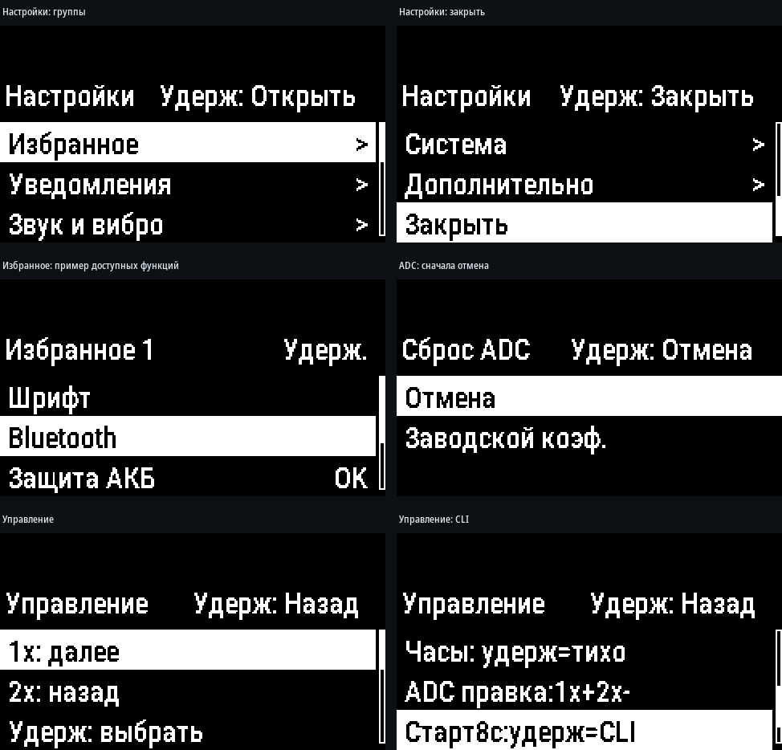

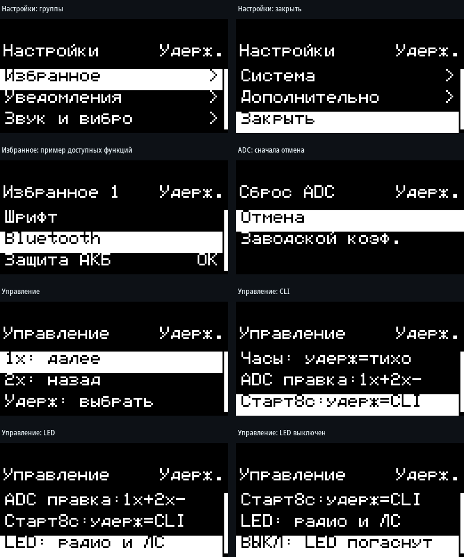

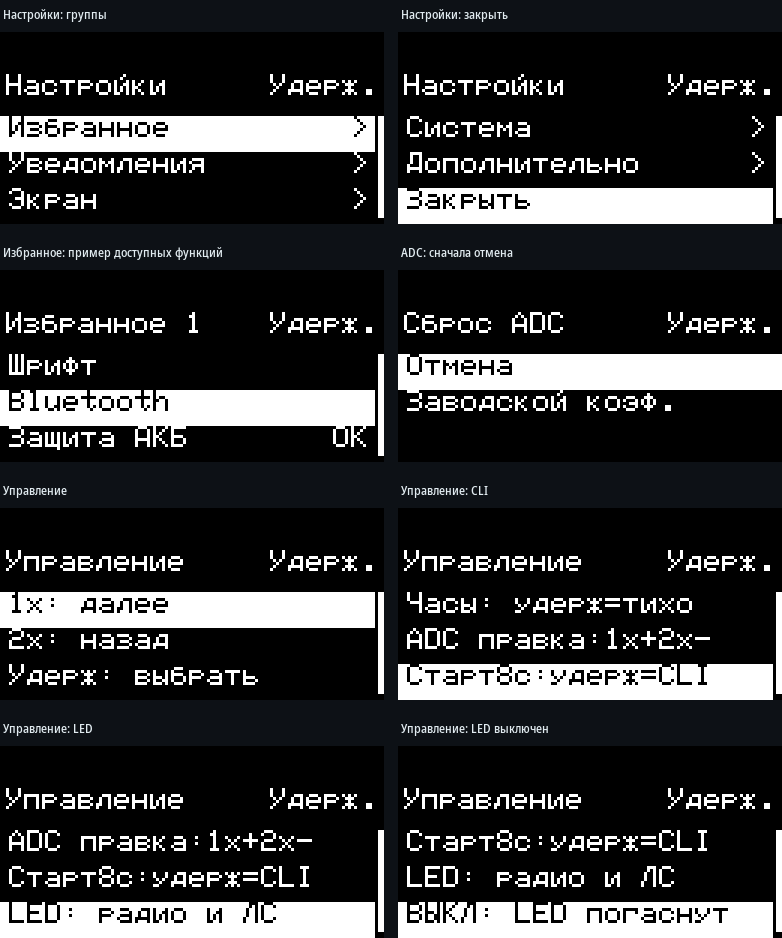

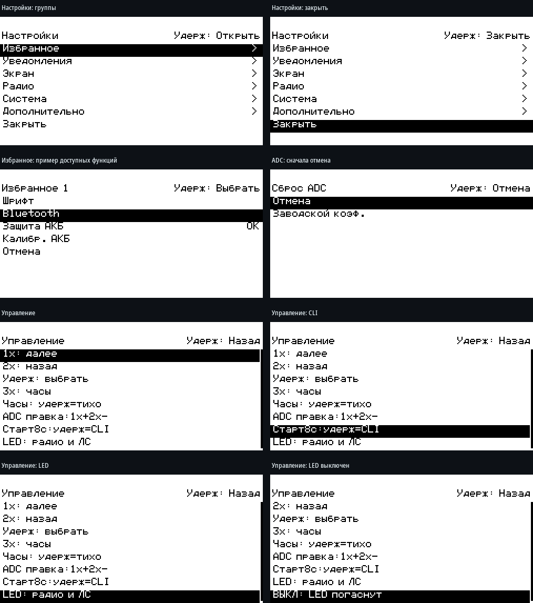

## Непрочитанные личные сообщения

Окно непрочитанных не копирует историю канала. Оно показывает только личные сообщения: отправителей, их количество и последнюю реплику. Отправители сортируются по свежести.

| T096 FEM | T114 | ProMicro RA62 |
|---|---|---|
|  |  |  |

## Шрифты

Шрифт выбирается отдельным списком. Активный вариант помечается `OK`, а текущая строка выделяется целиком.

### T096 FEM, TFT 160×80

Доступны 15 публичных профилей: пять семейств в трёх размерах. Самые маленькие служебные профили не выводятся в публичный список.


Темы: `Графит`, `Полночь`, `Хвоя`, `Бумага`, `Бордо`, `Север`, `Высокий`.

### T114, TFT 240×135

Доступны 10 профилей: `Roboto L`, `Noto L`, `OpenSans L`, `PT Narrow L`, `Oswald L`, `Roboto XL`, `OpenSans XL`, `Oswald XL`, `Noto XXL`, `PT Narrow XXL`.


Темы: `Стандарт`, `Циан`, `Янтарь`, `Бумага`, `Красный`, `Рыжий`, `Зеленый`.

Все элементы одной темы T114 используют одну пару цветов. Зелёного GPS и красного mute одновременно на этой плате нет — прежний симулятор показывал их ошибочно. Состояние GPS теперь различается текстом: `GPS OFF` — отключён, `GPS ...` — поиск, `GPS FIX` — есть координаты.

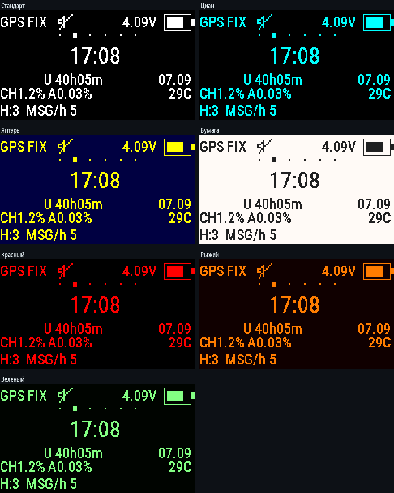

### ProMicro RA62, OLED 128×64

Монохромный OLED предлагает пять стилей: `Classic`, `Air`, `Strong`, `Narrow`, `Dense`. Цветных тем на нём нет; выделение выполняется инверсией или заливкой строки.


### Heltec V4.3 OLED

Используются те же пять точных OLED-стилей `Classic`, `Air`, `Strong`, `Narrow`, `Dense`. Проверяется не только верхняя строка GPS/тишина/АКБ, но и полная нижняя: скорость сообщений, GPS-значок с количеством спутников и температура, включая отрицательные и предельные значения. Подпись скорости сокращается до `M/h` или `/h`, если это необходимо для полного значения.

### Heltec Wireless Paper

E213 предлагает пять компактных renderer-profile: `Стандарт`, `Четкий`, `Компакт`, `Моно`, `Плотный`. Это профили над встроенной кириллической bitmap-таблицей, а не тяжёлый набор TrueType-шрифтов. Выделение выполняется чёрно-белой инверсией.

### Как выбрать

- Для максимальной вместимости начните с компактного семейства или размера L.
- Крупный профиль удобен для часов и коротких подписей, но длинные имена обрезаются раньше.
- Клавиатура и системные списки могут временно использовать безопасный компактный role-font, чтобы крупный пользовательский шрифт не ломал сетку.
- `...` означает контролируемую обрезку, а не потерю данных: полное имя остаётся в ноде и клиенте.

## Выбор настроек с подтверждением — dev.2

Это симуляции отдельной области настроек, а не фотографии и не полные экраны: верхняя служебная строка здесь опущена. Значения демонстрационные. `OK` отмечает действующий вариант; выделение перемещается без применения, а «Отмена» закрывает выбор без изменения настройки. У T096 список GPIO ниже показан только для отключённого мостового режима зуммера. Для ProMicro использован его собственный список пинов, а не список T096.

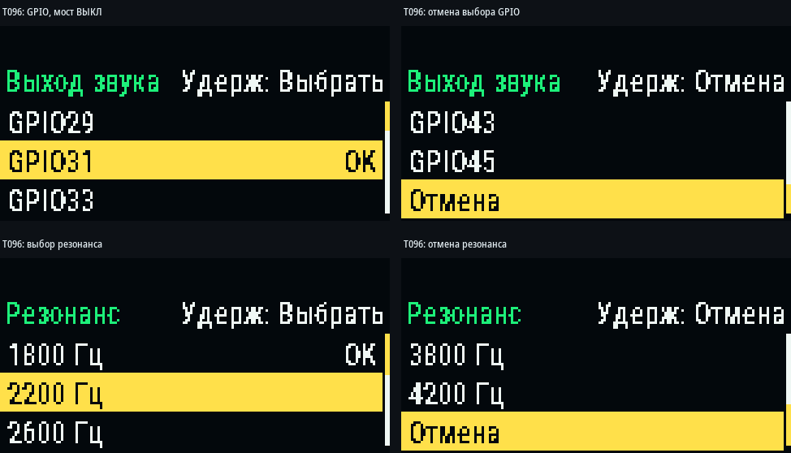

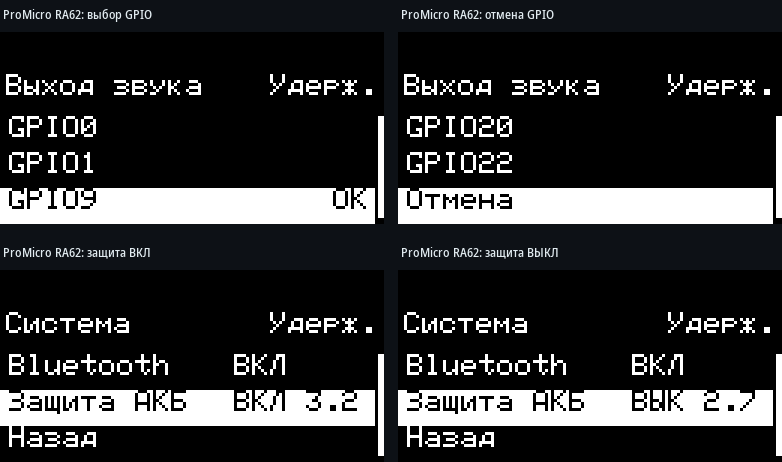

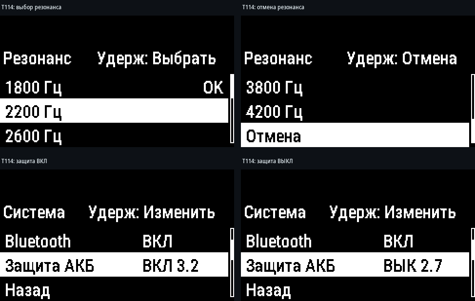

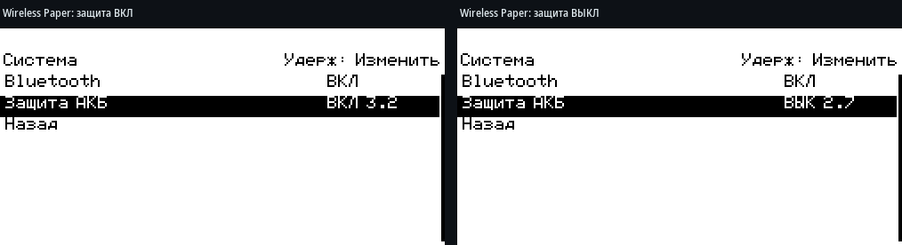

Включённая защита показывает порог `3.2 В`; при её отключении аварийный нижний порог `2.7 В` остаётся. Эти изображения не подтверждают точность измерения напряжения на физической плате. Пересоздание: `python tools/simulate_dev2_settings.py`. Скрипт использует реальные bitmap-таблицы T096/T114, пять стилей OLED и пять профилей E213; для T114 учитываются высота компактного шрифта 24 физических пикселя, масштаб 128×64 → 240×135 и смещение Y+1.

## Инженерные QA-матрицы

В `dev.2` исправлена прежняя модель компактного шрифта T114: настоящая высота 24px вместо 22px. По ней устранён выход нижней GPS-строки за экран. [Новая матрица GPS T114 с реальными глифами](assets/qa/dev2-t114-gps-physical-qa.png); окончательный core-прогон `dev.2` — 470/470. Исторические числа ниже относятся к прежней модели.

Полные матрицы отделены от пользовательской галереи. Они показывают граничные случаи и прежние/исправленные варианты:

- [T096: точная QA-матрица](assets/qa/T096_SMARTUI_PS17_EXACT_QA_MATRIX.png);
- [T114: QA после физического масштабирования](assets/qa/T114_SMARTUI_PS17_EXACT_QA_MATRIX.png);
- [T114: аппаратный GPS и границы экрана](assets/qa/T114_SMARTUI_PS17_GPS_APPEARANCE_PHYSICAL_QA.png);
- [ProMicro OLED: точная QA-матрица](assets/qa/OLED_SMARTUI_PS17_EXACT_QA_MATRIX.png).
- [V4.3 OLED: GPS/mute/battery QA](assets/qa/V4_3_OLED_SMARTUI_2_1_EXACT_QA_MATRIX.png).
- [Wireless Paper: 250×122 exact QA](assets/qa/WIRELESS_PAPER_SMARTUI_2_1_EXACT_QA_MATRIX.png).

Интегрированный PS17 RC прошёл `455 PASS / 0 FAIL`. Стресс-тест охватывает 0, 1 и 350 контактов, длинные русские имена, три страницы клавиатуры, 0, 1 и 12 отправителей ЛС, до 30 сохранённых ЛС, все публичные шрифты и состояния GPS T114. Это результат точной модели интерфейса, а не сертификат электрической или радиочастотной части платы.

Исторические полные hotfix-матрицы `2.1.0-dev.1` (не результаты проверки `dev.2`): core/T096/T114 `470/470`, V4.3 + ProMicro OLED `25/25`, Wireless Paper `180/180`, без выходов за framebuffer и непредусмотренных пересечений. PIN-страница проверена всеми пятью семействами плат и всеми публичными шрифтами; на OLED 128×64 используется подсказка «код в приложении». На e-paper обрезанные концы декоративных линий Wood являются намеренным clipping, а не текстовыми потерями.

## Как пересоздать галерею

Из корня репозитория:

```text
python -m pip install -r requirements-qa.txt
python tools/generate_docs_assets.py
```

Скрипт пересоздаёт пользовательские PNG всех пяти плат в `docs/assets/ui/` и точные V4.3/Wireless Paper матрицы в `docs/assets/qa/`. Внутри он запускает специализированные симуляторы с правильной геометрией и шрифтами. После изменения UI результат нужно проверить визуально.

Для временных эффектов отдельно исполняются настоящие C++-фрагменты `uiMarqueeOffset` и `E213Display::endFrame` с записывающими заглушками. Они проверяют фазу бегущей строки, пропуск одинакового CRC операций рисования и полный refresh после 24 изменившихся кадров. Это не эмуляция кнопок, радиособытий или задержки BUSY. На Paper необходима физическая приёмка: набор → адресат → входящее ЛС → возврат к часам → полный refresh, с оценкой задержки и остаточного изображения.
