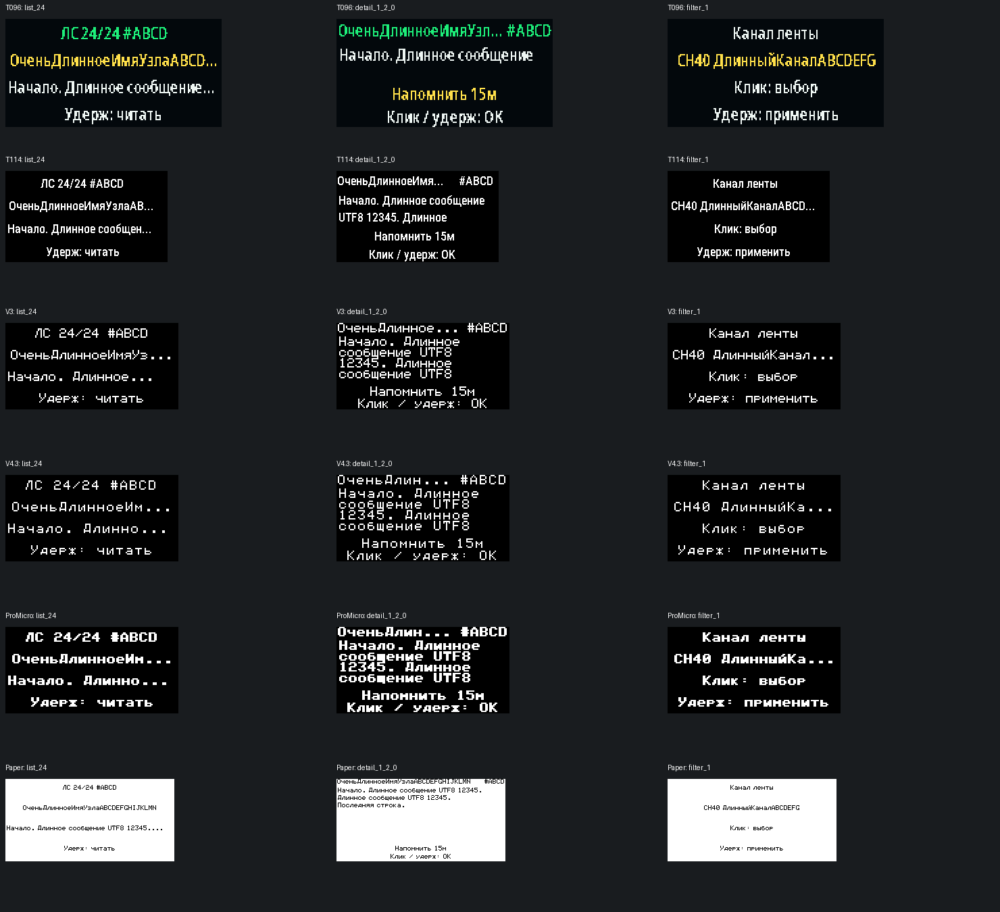

# SmartUI 0.06-test.2: как пользоваться тестовой версией

Это отдельная тестовая версия на основе 0.06. Она не заменяет [основной выпуск 0.06](https://github.com/YaziAranea/MeshCore/releases/tag/smartui-0.06). Поддерживаются T096 FEM ON, T114, ProMicro RA62, V3 OLED, V4.3 OLED FEM ON и Wireless Paper FULL.

В test.2 сохранены функции test.1, но упрощены настройки: убраны «Избранное» и «Отменить изменение», звуковые параметры перенесены в «Звук и вибро». «Назад», отмена незавершённого выбора и восстановление значения при ошибке записи остались. [Меню на разных экранах](SCREENS_RU.md), [управление](CONTROLS_RU.md).

Исправление зависаний T096 в этот выпуск не входит. Симуляции и успешная сборка не подтверждают отсутствие зависаний на физической плате.

## 1. Прочитать ЛС и ответить человеку

1. Откройте экран непрочитанных личных сообщений. Ещё один вход: чат → удержание → `Входящие ЛС`.
2. Один щелчок выбирает следующее сообщение, двойной — предыдущее. Видны имя, начало текста и номер сообщения. Суффикс `#ABCD` помогает различать похожие имена, но не заменяет проверку полного ключа контакта.
3. Удерживайте кнопку: откроется текст. Длинный текст прокручивается автоматически; имя отправителя и действие остаются на месте.
4. Щелчками выбирайте действие; удержанием подтверждайте.
5. `Ответить` открывает ввод с привязкой к этому контакту. Если контакт удалён или недоступен, прошивка не подменит его другим человеком с похожим именем. Ответ сам по себе не помечает входящее прочитанным.
6. `Прочитано` убирает только выбранное сообщение из списка на ноде. Простое открытие сообщения не помечает всю переписку прочитанной. Это локальная отметка, не уведомление отправителю о прочтении.
7. `Назад` возвращает к выбору сообщений. Тройной щелчок возвращает на главный экран.

Входящие ограничены памятью ноды. Перезагрузка очищает список, новые сообщения со временем вытесняют старые. Это не постоянный архив переписки и не черновики.

## 2. Отложить напоминание на 15 минут

1. Откройте нужное ЛС.
2. Выберите `Напомнить 15м` и подтвердите удержанием.
3. Это сообщение останется непрочитанным, его текущий сигнал прекратится. Новые сообщения продолжают оповещать независимо.
4. После отсрочки напоминание вновь разрешено с учётом общих настроек уведомлений, беззвучного и ночного режима. Если другое важное оповещение уже активно, отсроченное ждёт освобождения уведомления.

Отсрочка действует только пока сообщение остаётся в оперативной памяти. После перезагрузки она не сохраняется. Она не включает общую тишину.

## 3. Показать в чате только нужный канал

1. На странице чата удерживайте кнопку, чтобы открыть быстрые ответы и действия.
2. Выберите `Канал ленты...`.
3. Щелчками выберите `Все каналы` либо один известный ноде канал; удержанием примените.
4. Выбранный фильтр подписан над лентой. Если канал удалён или изменён через приложение, фильтр сбрасывается с уведомлением.

Фильтр меняет только отображение. Он не меняет радиочастоту, не отключает приём остальных каналов и не выбирает автоматически адресата отправки. История по-прежнему общая и ограниченная: отдельного архива каждого канала нет.

## 4. Задать свои быстрые ответы

1. Скачайте `SmartUI_USB_Helper_1.2.html` из тестового релиза и откройте в настольном Chrome или Edge. ZIP содержит тот же помощник и инструкцию.
2. Подключите ноду кабелем с передачей данных. Разбудите экран. Закройте другие программы, занимающие COM-порт.
3. Для обычного обслуживания выберите на ноде Bluetooth или Wi-Fi: режим USB-компаньона использует тот же порт для приложения. При ошибке восстановления настроек сервисная консоль доступна отдельно.
4. Нажмите подключение в помощнике, выберите порт ноды и дождитесь сведений о прошивке.
5. В блоке `Свои быстрые фразы` нажмите `Прочитать фразы с ноды`.
6. Измените нужную строку и сохраните именно её. Всего девять слотов. Пустое значение возвращает стандартную фразу.
7. Максимум — 64 байта UTF-8: русская буква обычно занимает два байта. Помощник показывает ограничение до отправки.
8. После сохранения фраза появится в быстрых ответах ноды и сохранится после обычной перезагрузки. Перед отправкой по-прежнему выбирается адресат.

Новые фразы требуют тестовую прошивку. Старые 0.05/0.06 могут использовать обычные функции помощника, но не получают неподдерживаемые команды редактирования фраз.

## 5. Проверить файл перед прошивкой

1. Скачайте файл своей платы и `RELEASE-MANIFEST.json` из одного релиза.
2. В помощнике откройте блок `Проверить файл прошивки`.
3. Выберите оба файла или перетащите их в этот блок. Выберите свою плату; при подключённой сервисной консоли учитываются сведения ноды.
4. Помощник проверит структуру BIN/UF2, встроенные сведения о сборке и SHA-256 по манифесту. Несовпадение платы, файла или хеша — повод остановиться и скачать правильный комплект.
5. Эта функция работает локально. Она не отправляет файлы в Интернет и не прошивает устройство.

Совпавший хеш означает совпадение с выбранным манифестом, а не независимое доказательство подлинности. Проверка не определяет совместимость уже установленного загрузчика и таблицы разделов ESP32.

## Важное перед установкой

1. UF2 — только для указанной nRF52-платы. BIN — для ESP32, строго своей модели.
2. `update.bin` записывается по `0x10000`, без очистки, при совместимых загрузчике и разделах.
3. **`merged.bin` записывается по `0x0` и перезаписывает identity, контакты и настройки даже без Erase Flash.** Сохраните необходимые данные до установки.
4. Сообщавшийся чёрный экран V4.3 после app-only update не объявлен исправленным: без загрузочного лога его причина не установлена.
5. Wi-Fi companion использует TCP 5000 без отдельной авторизации/TLS. Только доверенная локальная сеть; не открывайте этот порт в Интернет.

## Что проверено программно

Это увеличенные кадры программной симуляции с реальными метриками шрифтов, не фотографии устройств. Цвет и свечение физического экрана могут отличаться.

Новые экраны проверяются на реальных метриках встроенных шрифтов T096, T114, OLED и Paper; тесты выполняют функции отрисовки из прошивки. Проверяются также чтение выбранного ЛС, независимые уведомления, фильтрация по ключу канала, переполнение таймеров, восстановление настроек и обработка отказов радио.

Это не физические испытания всех плат. В отзыве укажите плату, полное имя файла, способ установки и точные шаги. Особенно полезны проверки: другое ЛС во время отсрочки, длинный русский текст, смена канала через приложение и собственные быстрые фразы.
